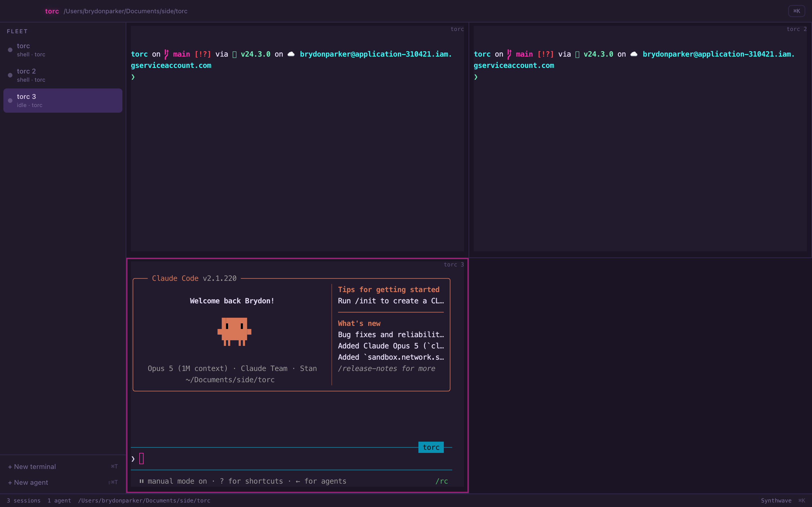

# Torc

A fleet console for CLI coding agents. Run several Claude Code sessions side by side, see at a glance
which one is working and which one is blocked on you, and drive all of it from ⌘K.

Torc is **not** an editor. Keep editing in VS Code or Cursor. Torc is the layer above the terminal
that the multi-agent workflow is missing.


*Five agents across five repos — one still working, four blocked waiting on you. Every card carries
the live tool feed, git branch, token count and running cost. Nothing here is mocked.*

## Why

Running four or five agents in parallel doesn't make you four or five times faster — it makes you a
bad scheduler for four or five processes that each need your attention at unpredictable moments. One
finishes and sits idle for ten minutes. One is stuck on a permission prompt. You find out by cycling
through terminal tabs.

## What works today

- **Real terminals.** `node-pty` + xterm.js with the WebGL renderer, so any CLI works: `claude`,
  `codex`, plain `zsh`.
- **Live fleet monitoring.** Every agent's status, current tool call, git branch, token count and
  rough cost — and an amber **needs you** flag the moment an agent asks for permission.
- **Mission Control** (`⌘⏎`) — every agent as a card, sorted so whoever needs you is first.
- **It reaches you when you're elsewhere.** Native notification and a dock badge the moment an agent
  blocks; clicking the notification jumps to that pane.
- **Sessions survive a restart.** Layout and theme are saved, and agents come back via
  `claude --resume` with their conversation and scrollback intact.
- **Splits** — one, two or four panes on screen at once, so you can watch a second agent while the
  first works.
- **⌘K for everything** — prefix modes: `@` jump to an agent, `/` send a slash command to the focused
  pane, `!` broadcast a prompt to the whole fleet.
- **Three themes** — Notion (light), Synthwave (cyberpunk), Matrix.

Monitoring reads Claude Code's own structured surfaces rather than scraping the terminal: hooks for
instant state changes, the session transcript for detail, and `claude agents --json` to reconcile and
to discover agents you started by hand. See [docs/architecture.md](docs/architecture.md).

## What it looks like

One, two or four panes on screen, so you can watch a second agent while the first works. The focused
pane is outlined:



⌘K drives everything, with prefix modes. Here `!` broadcasts a prompt to the whole fleet — note it
targets the one agent and skips the two plain shells:


Three themes, because this is where the day goes — Notion for daylight, Synthwave for the rest of it:

| Notion | Synthwave |
| --- | --- |
|  |  |

There's a Matrix theme too — that's the first screenshot.

## Running it

```bash
npm install          # rebuilds node-pty against Electron
npm run icon         # generates build/icon.icns (no image deps needed)
npm run dev
```

| Key | Action |
|---|---|
| `⌘T` | New terminal — run `claude` in it and Torc monitors it like any agent |
| `⇧⌘T` | New agent (skips the shell and starts Claude Code directly) |
| `⌘K` | Command palette |
| `⌘⏎` | Mission Control (esc to leave, `⌘0` also works) |
| `⌘⇧A` | Jump to the next agent that needs you |
| `⌘⇧[` / `⌘⇧]` | Previous / next agent |
| `⌘1`–`⌘9` | Jump to agent |
| `⌘F` | Find in the active terminal |
| `⌥⌘1` / `⌥⌘2` / `⌥⌘4` | One, two or four panes on screen |
| `⌃⇥` | Jump back to the pane you were just in |
| `⌘P` | Quick switch to an agent by name |
| `⌃⌘T` | Cycle theme |
| `⌘⇧R` | Restart pane (agents resume) |
| `⌘W` | Close pane |

`npm run dist` produces a real `Torc.app` plus a DMG in `release/`. Use that rather than `npm run dev`
for daily driving — the dev build reports itself as "Electron" in the menu bar, because macOS reads
the app name from Electron's own signed bundle.

State lives in `~/.torc/`: `state.json` (layout), `hooks.settings.json` (generated, passed to each
agent via `--settings`) and `bin/claude` (a shim that adds those hooks to a `claude` you launch
yourself). All three are rewritten on launch; deleting them is safe.

## Development

```bash
npm run typecheck
npm test                                  # vitest
TORC_QA=/tmp/shots npm run dev            # screenshots itself, 10 steps
TORC_DEMO=/tmp/demo npm run dev           # launches a real fleet across repos, read-only
TORC_DEBUG_HOOKS=1 npm run dev            # log every hook event received
TORC_QA_MODE=restore npm run dev          # check session restore
TORC_QA_MODE=split npm run dev            # check splits, broadcast, notifications
```

The QA and demo harnesses drive the renderer through `window.__torc` and capture with
`webContents.capturePage()`, which works regardless of which window is frontmost.

## Status

Usable. Terminals, splits, ⌘K, themes, monitoring, notifications and session restore all work,
verified against a real five-agent fleet and in the packaged build. Not yet built: cross-agent
context sharing, and adapters that give non-Claude agents the same monitoring depth.

Apache-2.0.
