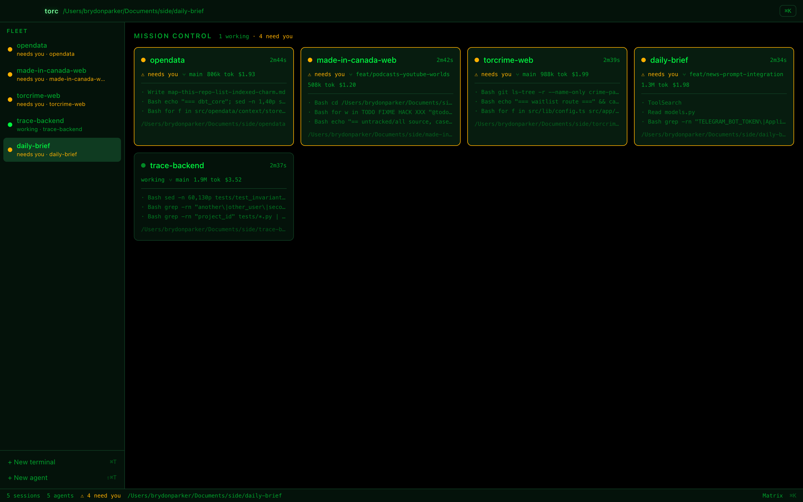
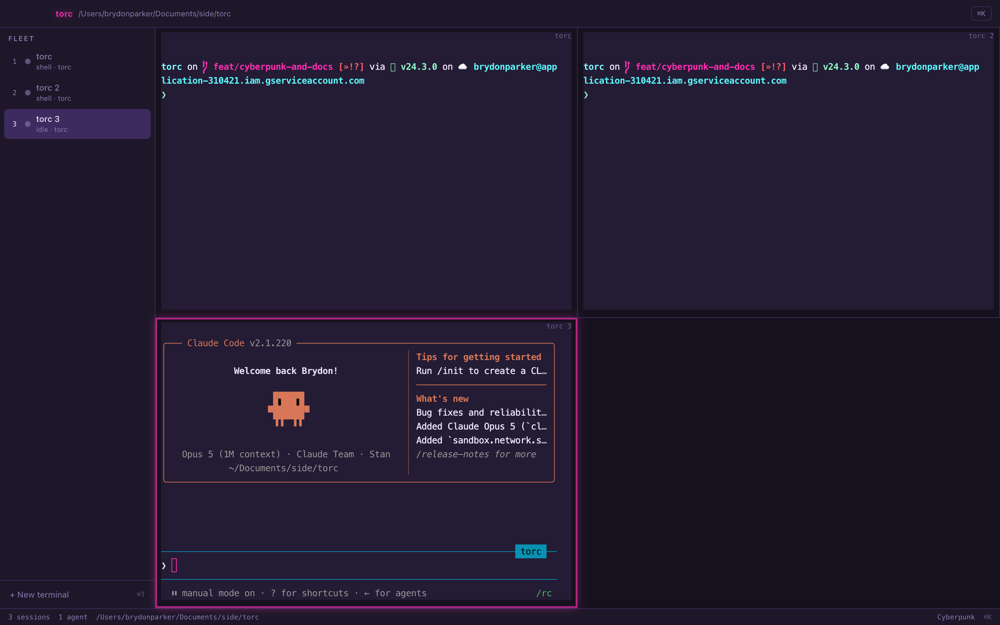
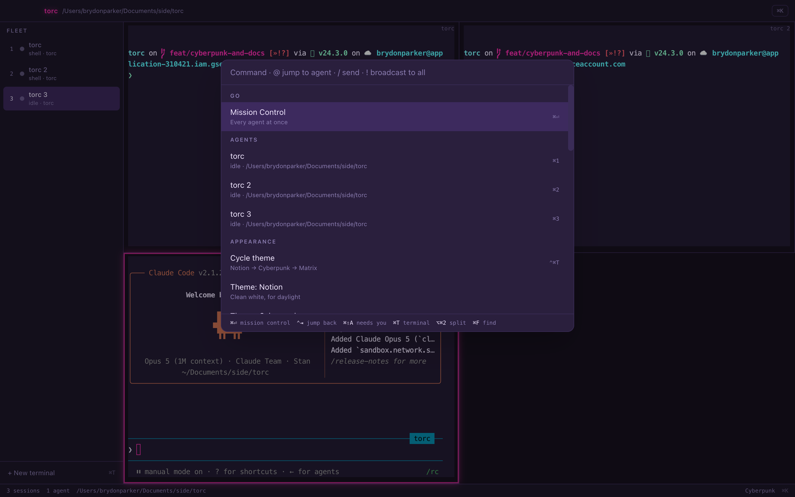
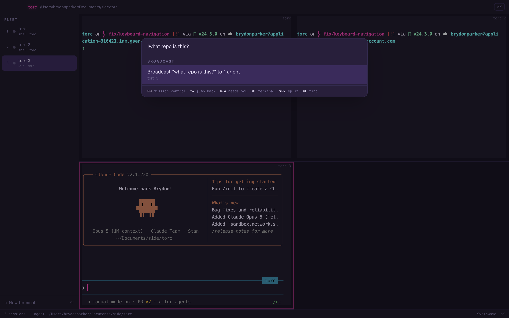
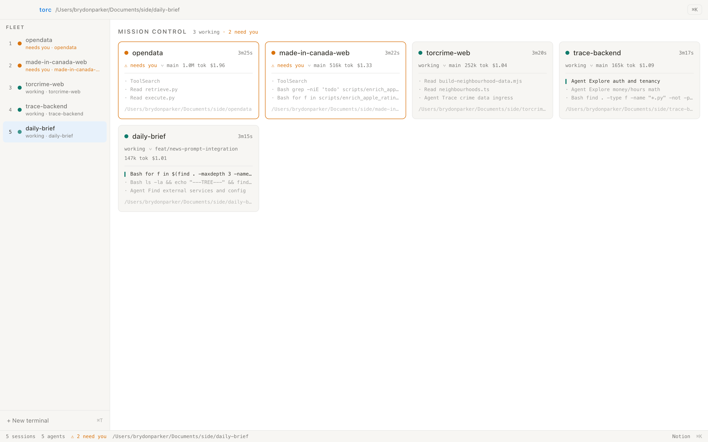
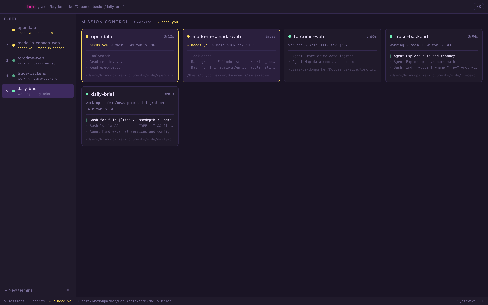

# Torc

A fleet console for CLI coding agents. Run several Claude Code sessions side by side, see at a glance
which one is working and which one is blocked by you, and drive all of it from ⌘K.

Torc is **not** an editor. Keep editing in VS Code or Cursor. Torc is the layer above the terminal
that the multi-agent workflow is missing.



*Five agents across five repos — three still working, two blocked waiting on you. Every card carries
the live tool feed, git branch, token count and running cost. Nothing here is mocked.*

## Why

Running four or five agents in parallel doesn't make you four or five times faster — it makes you a
bad scheduler for four or five processes that each need your attention at unpredictable moments. One
finishes and sits idle for ten minutes. One is stuck on a permission prompt. You find out by cycling
through terminal tabs.

## What works today

- **Real terminals.** `node-pty` + xterm.js with the WebGL renderer, so any CLI works: `claude`,
  `codex`, plain `zsh`.
- **Live fleet monitoring.** Every agent's status, current tool call, git branch, token count and
  rough cost — and an amber **needs you** flag the moment an agent asks for permission.
- **Mission Control** (`⌘⏎`) — every agent as a card, sorted so whoever needs you is first.
- **It reaches you when you're elsewhere.** Native notification and a dock badge the moment an agent
  blocks; clicking the notification jumps to that pane.
- **Sessions survive a restart.** Layout and theme are saved, and agents come back via
  `claude --resume` with their conversation and scrollback intact.
- **Splits** — one, two or four panes on screen at once, so you can watch a second agent while the
  first works.
- **⌘K for everything** — prefix modes: `@` jump to an agent, `/` send a slash command to the focused
  pane, `!` broadcast a prompt to the whole fleet.
- **Three themes** — Notion (light), Cyberpunk, Matrix.

Monitoring reads Claude Code's own structured surfaces rather than scraping the terminal: hooks for
instant state changes, the session transcript for detail, and `claude agents --json` to reconcile and
to discover agents you started by hand. See [docs/architecture.md](docs/architecture.md).

## What it looks like

One, two or four panes on screen, so you can watch a second agent while the first works. The focused
pane is outlined:



⌘K leads with whichever view you're *not* in, numbers every agent, and keeps the shortcuts worth
knowing along the bottom — so the palette is also where you learn the keyboard:



It has prefix modes too. Here `!` broadcasts a prompt to the whole fleet — note it targets the one
agent and skips the two plain shells:



Three themes, because this is where the day goes — Notion for daylight, Cyberpunk for the rest of it:

| Notion | Cyberpunk |
| --- | --- |
|  |  |

There's a Matrix theme too — that's the first screenshot.

## Getting started

**You'll need:** macOS on Apple silicon, Node 20+, and [Claude Code](https://claude.com/claude-code)
installed and signed in. Check the last one first — Torc drives the `claude` binary, so if
`claude --version` doesn't work in your terminal, nothing else will:

```bash
claude --version
node --version
```

Then:

```bash
git clone https://github.com/parker84/torc.git
cd torc
npm install        # also rebuilds node-pty against Electron's ABI
npm run icon       # generates build/icon.icns from assets/logo.png
npm run dev        # dev build, hot reloads
```

For daily use, build the real app instead — you get the proper name and icon, and it launches from
Spotlight:

```bash
npm run dist                          # writes release/Torc.app and a .dmg
cp -R release/mac-arm64/Torc.app /Applications/
```

The build is unsigned, so the first launch may need a right-click → **Open** (or
System Settings → Privacy & Security → Open Anyway). macOS may also ask to allow notifications —
say yes, that's how Torc tells you an agent is blocked.

### First run

1. `⌘T` opens a terminal in the folder Torc was launched from.
2. Type `claude` and hit enter. Within a couple of seconds the rail shows it as an agent, with its
   status, branch, token count and cost.
3. Give it something slow to do, then hit `⌘⏎` to watch the whole fleet.
4. `⌘K` for everything else.

You don't have to launch agents through Torc — a `claude` you start yourself in any Torc terminal is
picked up automatically, with the same monitoring. (`⇧⌘T` skips the shell if you'd rather.)

### Where state lives

Everything is under `~/.torc/`, all of it regenerated on launch and safe to delete:

| Path | What |
|---|---|
| `state.json` | Open panes, active pane and theme, restored on next launch |
| `hooks.settings.json` | Hook config passed to each agent via `claude --settings` |
| `bin/claude` | Shim that adds those hooks to a `claude` you launch yourself |

Torc never edits your `~/.claude/settings.json`.

### Troubleshooting

| Symptom | Cause |
|---|---|
| Panes open but `claude` isn't found | `claude` isn't on your login shell's `PATH`. Torc reads the environment from `$SHELL -l`, so check `claude --version` works in a fresh login shell. |
| An agent shows no tokens or title | Its transcript isn't being written. Most often you launched Torc from inside a Claude Code session in an older build; relaunch from Finder or a plain terminal. |
| No notifications | System Settings → Notifications → Torc. Unsigned builds sometimes don't prompt. |
| `npm install` fails building node-pty | Xcode command line tools missing: `xcode-select --install`. |

### Shortcuts

| Key | Action |
|---|---|
| `⌘T` | New terminal — run `claude` in it and Torc monitors it like any agent |
| `⇧⌘T` | New agent (skips the shell and starts Claude Code directly) |
| `⌘K` | Command palette |
| `⌘⏎` | Mission Control (esc to leave, `⌘0` also works) |
| `⌘⇧A` | Jump to the next agent that needs you |
| `⌘⇧[` / `⌘⇧]` | Previous / next agent |
| `⌘1`–`⌘9` | Jump to agent |
| `⌘F` | Find in the active terminal |
| `⌥⌘1` / `⌥⌘2` / `⌥⌘4` | One, two or four panes on screen |
| `⌃⇥` | Jump back to the pane you were just in |
| `⌘P` | Quick switch to an agent by name |
| `⌥⌘T` | Cycle theme (or click the theme name in the status bar) |
| `⌘⇧R` | Restart pane (agents resume) |
| `⌘W` | Close pane |

Selected text copies with `⌘C`, or right-click a pane for Copy and Paste.

One note on the dev build: it reports itself as "Electron" in the menu bar, because macOS takes the
app name from Electron's own signed bundle. `npm run dist` is the one that says Torc.

## Development

```bash
npm run typecheck
npm test                                  # vitest
TORC_QA=/tmp/shots npm run dev            # screenshots itself, 10 steps
TORC_DEMO=/tmp/demo npm run dev           # launches a real fleet across repos, read-only
TORC_DEBUG_HOOKS=1 npm run dev            # log every hook event received
TORC_QA_MODE=restore npm run dev          # check session restore
TORC_QA_MODE=split npm run dev            # check splits, broadcast, notifications
TORC_QA_MODE=keys npm run dev             # check shortcuts from a focused terminal
TORC_QA_MODE=copy npm run dev             # check right-click copy and paste
TORC_QA_MODE=palette npm run dev          # shoot the palette over a working fleet
TORC_SCENARIOS=/tmp/scen npm run dev      # 23 assertions over real user flows
```

The QA and demo harnesses drive the renderer through `window.__torc` and capture with
`webContents.capturePage()`, which works regardless of which window is frontmost.

## Status

Usable. Terminals, splits, ⌘K, themes, monitoring, notifications and session restore all work,
verified against a real five-agent fleet and in the packaged build. Not yet built: cross-agent
context sharing, and adapters that give non-Claude agents the same monitoring depth.

Apache-2.0.
